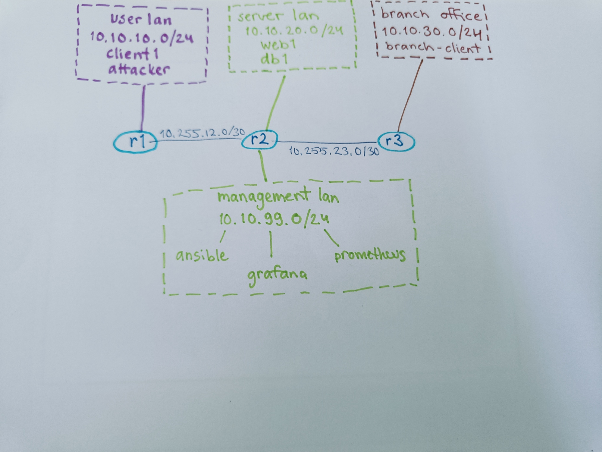

Viikko 1 – Verkon dokumentointi

1. Johdanto

Tässä tehtävässä tutustuin kurssin virtuaaliseen verkkoympäristöön. Selvitin ympäristön laitteita, IP-osoitteita ja verkkojen välisiä yhteyksiä. Lisäksi testasin yhteyksiä pingillä ja tutkin liikenteen reittiä traceroutella.

2. Verkkokaavio

3. Laiteluettelo

| Laite         | Tarkoitus                                      |
| ------------- | ---------------------------------------------- |
| r1            | Reitittää User LANin liikennettä r2:lle        |
| r2            | Yhdistää eri verkot toisiinsa                  |
| r3            | Yhdistää Branch Office LANin muuhun verkkoon   |
| client1       | User LANin asiakaslaite                        |
| attacker      | Tietoturvatestaukseen tarkoitettu asiakaslaite |
| web1          | Web-palvelin                                   |
| db1           | Tietokantapalvelin                             |
| branch-client | Branch Office -verkon asiakaslaite             |
| ansible       | Ansible-automaatiota varten                    |
| prometheus    | Valvontatietojen keräämiseen                   |
| grafana       | Valvontatietojen näyttämiseen                  |
| zabbix        | Verkon ja palveluiden valvontaan               |

4. IP-suunnitelma
Verkot 
 
| Verkko         | Tarkoitus         | Yhdyskäytävä              | 
| ---------------| ----------------- | --------------------------| 
| 10.10.10.0/24  | User LAN          | 10.10.10.1                | 
| 10.10.20.0/24  | Server LAN        | 10.10.20.1                | 
| 10.10.30.0/24  | Branch Office LAN | 10.10.30.1                | 
| 10.10.99.0/24  | Management LAN    | 10.10.99.1                | 
| 10.255.12.0/30 | r1–r2             | 10.255.12.1 / 10.255.12.2 | 
| 10.255.23.0/30 | r2–r3             | 10.255.23.1 / 10.255.23.2 | 
 
Laitteiden IP-osoitteet 

| Laite         | IP-osoite      | 
| ------------- | -------------- | 
| client1       | 10.10.10.101   | 
| attacker      | 10.10.10.200   | 
| web1          | 10.10.20.101   | 
| db1           | 10.10.20.102   | 
| branch-client | 10.10.30.101   | 

5. Reitityksen analyysi

Testasin yhteyttä client1ä palvelinverkossa olevaan web1-palvelimeen osoitteeseen 10.10.20.101. Kaikki neljä ping-pakettia menivät perille eikä pakettihäviötä ollut. Yhteys palvelinverkkoon toimii.

Testasin myös yhteyttä branch-client-laitteeseen osoitteessa 10.10.30.101. Myös tässä testissä kaikki neljä pakettia menivät perille eikä pakettihäviötä ollut. Yhteys haarakonttorin verkkoon toimii.

Liikenne kulkee siis client1ä ensin r1 kautta r2 ja siitä r3 kautta branch-clientille. Reititys toimii testien perusteella oikein.

Komentojen tulosteet

Annettu komento:
ip addr
Tuloste:

1: lo: <LOOPBACK,UP,LOWER_UP> mtu 65536 qdisc noqueue state UNKNOWN group default qlen 1000
    link/loopback 00:00:00:00:00:00 brd 00:00:00:00:00:00
    inet 127.0.0.1/8 scope host lo
       valid_lft forever preferred_lft forever
    inet6 ::1/128 scope host
       valid_lft forever preferred_lft forever
2: eth0@if4394: <BROADCAST,MULTICAST,UP,LOWER_UP> mtu 1500 qdisc noqueue state UP group default
    link/ether ce:72:e0:f5:40:33 brd ff:ff:ff:ff:ff:ff link-netnsid 0
    inet 172.20.20.16/24 brd 172.20.20.255 scope global eth0
       valid_lft forever preferred_lft forever
4372: eth1@if4373: <BROADCAST,MULTICAST,UP,LOWER_UP> mtu 9500 qdisc noqueue state UP group default
    link/ether aa:c1:ab:58:27:40 brd ff:ff:ff:ff:ff:ff link-netnsid 1
    altname clab-o-05031180f95d8850
    inet 10.10.10.101/24 scope global eth1
       valid_lft forever preferred_lft forever
    inet6 fe80::a8c1:abff:fe58:2740/64 scope link
       valid_lft forever preferred_lft forever

Annettu komento:
ip route
Tuloste:

default via 10.10.10.1 dev eth1
10.10.10.0/24 dev eth1 proto kernel scope link src 10.10.10.101
172.20.20.0/24 dev eth0 proto kernel scope link src 172.20.20.16

Annettu komento:
ping -c 4 10.10.20.101
Tuloste:

PING 10.10.20.101 (10.10.20.101) 56(84) bytes of data.
64 bytes from 10.10.20.101: icmp_seq=1 ttl=62 time=0.656 ms
64 bytes from 10.10.20.101: icmp_seq=2 ttl=62 time=0.138 ms
64 bytes from 10.10.20.101: icmp_seq=3 ttl=62 time=0.169 ms
64 bytes from 10.10.20.101: icmp_seq=4 ttl=62 time=0.231 ms

--- 10.10.20.101 ping statistics ---
4 packets transmitted, 4 received, 0% packet loss, time 3066ms
rtt min/avg/max/mdev = 0.138/0.298/0.656/0.209 ms

Yhteys web1-palvelimeen toimii. Kaikki neljä pakettia saatiin perille eikä pakettihäviötä ollut.

Annettu komento:
ping -c 4 10.10.30.101
Tuloste:

PING 10.10.30.101 (10.10.30.101) 56(84) bytes of data.
64 bytes from 10.10.30.101: icmp_seq=1 ttl=61 time=0.535 ms
64 bytes from 10.10.30.101: icmp_seq=2 ttl=61 time=0.198 ms
64 bytes from 10.10.30.101: icmp_seq=3 ttl=61 time=0.183 ms
64 bytes from 10.10.30.101: icmp_seq=4 ttl=61 time=0.182 ms

--- 10.10.30.101 ping statistics ---
4 packets transmitted, 4 received, 0% packet loss, time 3064ms
rtt min/avg/max/mdev = 0.182/0.274/0.535/0.150 ms

Myös yhteys branch-clientiin toimii. Kaikki neljä pakettia saatiin perille eikä pakettihäviötä ollut.

Annettu komento:
traceroute 10.10.30.101
Tuloste:

traceroute to 10.10.30.101 (10.10.30.101), 30 hops max, 60 byte packets
 1  10.10.10.1 (10.10.10.1)  1.143 ms  0.781 ms  0.760 ms
 2  10.255.12.2 (10.255.12.2)  0.747 ms  0.575 ms  0.549 ms
 3  10.255.23.2 (10.255.23.2)  0.532 ms  0.318 ms  0.290 ms
 4  10.10.30.101 (10.10.30.101)  0.266 ms  0.234 ms  0.208 ms

6. Yhteenveto

Tehtävässä eniten aikaa meni verkon rakenteen selvittämiseen ja eri IP-osoitteiden löytämiseen. Kaikkia osoitteita ei näkynyt yhdellä komennolla, joten niitä piti tarkistaa eri konteista ja topologiatiedostosta. Ping- ja traceroute-testien avulla oli helpompi hahmottaa, miten liikenne kulkee reitittimien välillä.
Dokumentaatiosta on hyötyä verkon ylläpidossa, koska sen avulla voi nopeasti tarkistaa, missä verkossa laite on ja minkä reitittimen kautta liikenne kulkee. Se helpottaa myös vianetsintää, jos yhteys johonkin verkkoon ei myöhemmin toimi.

7. Tekoälyn käyttö

Käytin tehtävässä tekoälyä apuna verkkoympäristön komentojen ja niiden tulosteiden ymmärtämisessä. Kysyin myös apua koko verkkokaavion ymmärtämisessä ja tiedon analysoinnissa. 