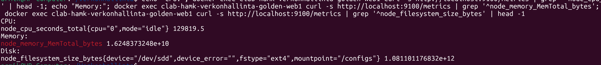
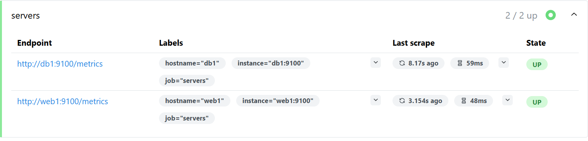
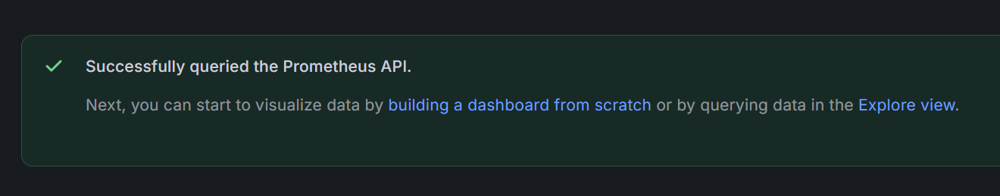
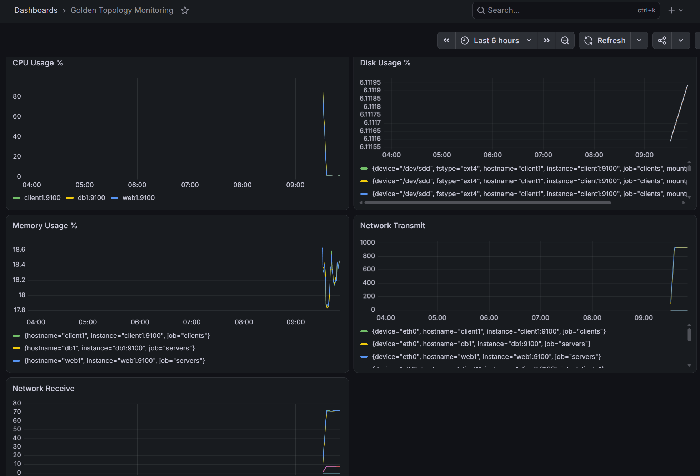
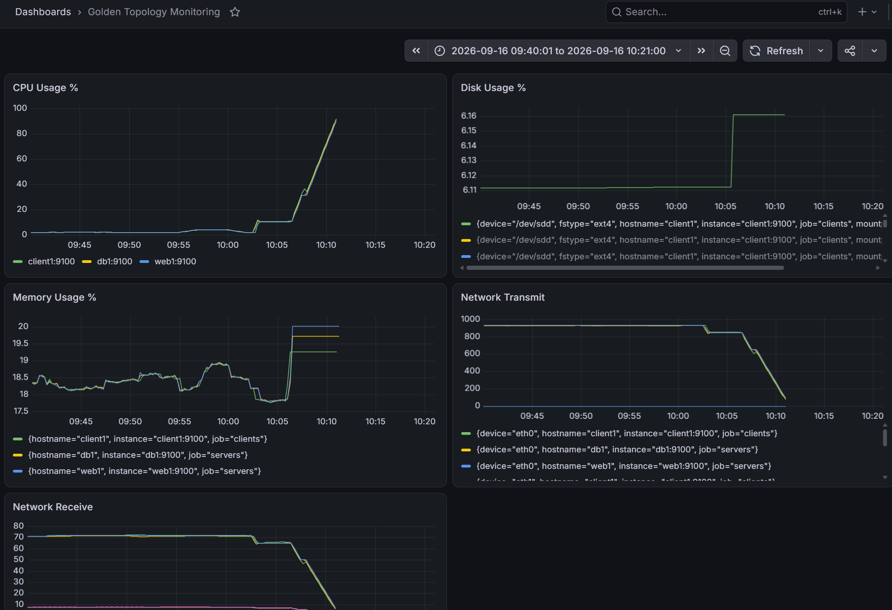

# 1. Johdanto
Prometheus kerää tietoa valvottavilta palvelimilta ja tallentaa mittarit omaan tietokantaansa. Tässä tehtävässä Node Exporter kerää web1-palvelimelta tietoja esimerkiksi CPU:n, muistin ja levytilan käytöstä. Prometheus hakee nämä tiedot Node Exporterilta ja niitä voidaan tarkastella Grafanan avulla. Grafanassa mittarit voidaan näyttää selkeinä käyrinä dashboardilla.

# 2. Node Exporterin käyttöönotto
Node Exporter asennettiin web1-konttiin. Ensin päivitettiin pakettilista ja varmistettiin, että tarvittavat työkalut olivat käytettävissä.
```bash
apt update
apt install wget tar -y
```
Node Exporter ladattiin GitHubista. Käytetty versio oli 1.12.1.
```bash
wget https://github.com/prometheus/node_exporter/releases/download/v1.12.1/node_exporter-1.12.1.linux-amd64.tar.gz
```

Paketti purettiin ja siirryttiin sen hakemistoon:
```bash
tar xvf node_exporter-1.12.1.linux-amd64.tar.gz
cd node_exporter-1.12.1.linux-amd64
```
Asennuksen toiminta tarkistettiin komennolla:
```bash
./node_exporter --version
```
Tuloksena saatiin Node Exporterin versioksi 1.12.1 ja alustaksi linux/amd64.

Node Exporter käynnistettiin komennolla:
```bash
./node_exporter
```

Node Exporterin toimintaa testattiin toisesta terminaalista komennolla:

```bash
docker exec clab-hamk-verkonhallinta-golden-web1 curl http://localhost:9100/metrics
```

Komento palautti suuren määrän mittareita. Tuloksissa näkyi esimerkiksi CPU:n, muistin ja levytilan mittareita. Tämän perusteella Node Exporter toimii oikein ja tarjoaa Prometheukselle kerättävää mittaustietoa.


Koska `curl`-komennon alkuperäinen tuloste oli erittäin pitkä, rajasin tulostetta `grep`- ja `head`-komennoilla. Näin sain näkyviin vain muutaman esimerkin eri mittareista.
```bash
 echo "CPU:"; docker exec clab-hamk-verkonhallinta-golden-web1 curl -s http://localhost:9100/metrics | grep '^node_cpu_seconds_total' | head -1; echo "Memory:"; docker exec clab-hamk-verkonhallinta-golden-web1 curl -s http://localhost:9100/metrics | grep '^node_memory_MemTotal_bytes'; echo "Disk:"; docker exec clab-hamk-verkonhallinta-golden-web1 curl -s http://localhost:9100/metrics | grep '^node_filesystem_size_bytes' | head -1
```



Näiden avulla tulosteesta saatiin lyhyempi ja raporttiin sopivampi kuvakaappaus.


# 3. Prometheus ja Grafana
Prometheuksesta tarkistin Target health -kohdasta, että web1 näkyy listassa. Web1 tila on UP, eli Prometheus se toimii.



Lisäsin Grafanaan Prometheuksen datalähteeksi. Prometheuksen osoitteeksi laitoin http://prometheus:9090. Lopuksi testasin yhteyden Save & test -painikkeella, ja yhteys toimi.


# 4. Dashboard


# 5. Kuormitustesti
Kuormitustestissä käytin web1-palvelimella 
```bash
yes > /dev/null 
```
-komentoa CPU-kuorman lisäämiseen. Grafanasta näki, että CPU Usage nousi selvästi noin 90 prosenttiin. Lisäksi testasin levyn käyttöä luomalla 500 MB tiedoston 
```bash
dd if=/dev/zero of=testfile.img bs=1M count=500
```
-komennolla. Levytilan käytössä näkyi pieni muutos. Verkkoliikenteessä ei tapahtunut vastaavaa nousua, koska testit eivät varsinaisesti aiheuttaneet verkkoliikennettä.


# 6. SNMP vs Prometheus
| Ominaisuus | SNMP | Prometheus |
|---|---|---|
| Tiedonkeruu | SNMP hakee tietoja laitteilta OID-tunnusten avulla. | Prometheus hakee mittareita yleensä HTTP:n kautta Node Exporterilta. |
| Käyttöönotto | SNMP-agentti pitää ottaa käyttöön ja määrittää. | Exporter asennetaan palvelimelle ja Prometheus määritetään hakemaan mittarit. |
| Mittarien määrä | Mittarien määrä riippuu laitteen SNMP-tuesta. | Node Exporter tarjoaa paljon valmiita järjestelmän mittareita. |
| Visualisointi | SNMP ei itsessään tarjoa dashboardia. | Prometheus toimii hyvin esimerkiksi Grafanan kanssa. |
| Hälytysmahdollisuudet | Hälytykset voidaan toteuttaa erillisillä työkaluilla. | Prometheuksessa voidaan käyttää alerting-toimintoja. |
| Soveltuvuus pilviympäristöihin | Sopii hyvin verkkolaitteiden valvontaan. | Sopii hyvin palvelimien ja konttien monitorointiin. |

Johtopäätöksenä Prometheus sopii hyvin tähän ympäristöön, koska sillä saa helposti kerättyä paljon tietoa palvelimista. SNMP taas on hyödyllinen erityisesti verkkolaitteiden valvonnassa. Näitä voidaan myös käyttää samassa ympäristössä eri tarkoituksiin.

# 7. Yhteenveto
1. Mikä on Prometheuksen tärkein hyöty verrattuna SNMP:hen?

Prometheuksen avulla palvelimista saa helposti paljon erilaisia mittareita. Mittarit ovat myös helppoja näyttää Grafanassa. SNMP sopii hyvin esimerkiksi verkkolaitteiden valvontaan, mutta Prometheus sopii hyvin esim. palvelimien monitorointiin.

2. Mitä mittareita ylläpitäjän pitäisi seurata jatkuvasti?

Tärkeitä mittareita ovat esimerkiksi CPU:n käyttö, muistin käyttö, levytilan käyttö ja verkkoliikenne. 

3. Mitä dashboard tarjoaa verrattuna pelkkään komentoriviin?

Dashboardista näkee mittarit helposti yhdestä paikasta ja muutokset näkyvät käyrinä. Komentoriviltä tietoja joutuu hakemaan erikseen komennoilla, joten dashboard helpottaa kokonaisuuden seuraamista.

4. Mitä uusia mittareita voisi lisätä dashboardiin?

Dashboardiin voisi lisätä esimerkiksi järjestelmän load-arvon, levy-I/O:n, verkon virhemäärät ja palvelimien uptime-ajan.

5. Miten Prometheus voisi auttaa vianetsinnässä?

Prometheus voi auttaa huomaamaan esimerkiksi CPU:n, muistin tai levytilan poikkeavan käytön. Käyrästä voi myös nähdä, milloin ongelma on alkanut ja mitä järjestelmässä tapahtui ennen sitä.

# 8. Tekoälyn käyttö

Hyödynsin tehtävän aikana tekoälyä apuna Prometheuksen, Node Exporterin ja Grafanan komentojen ja toimintaperiaatteen ymmärtämisessä sekä ongelmatilanteiden selvittämisessä. Tekoäly auttoi myös raportin rakenteen ja tekstin muotoilussa. Tehtävän komennot suoritettiin itse ja tarkistin saadut tulokset omassa ympäristössäni.