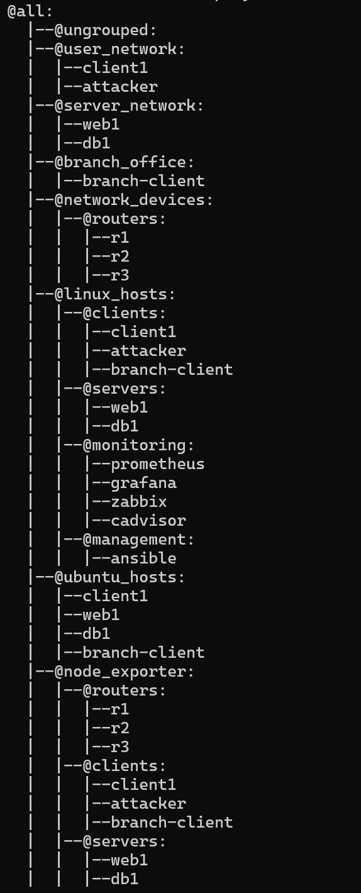
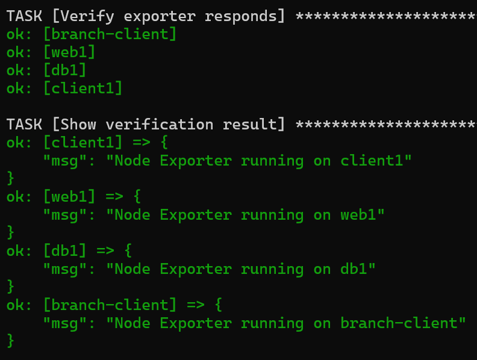

# 1. Johdanto
Infrastructure as Code (IaC) tarkoittaa infrastruktuurin, kuten palvelimien ja verkkolaitteiden, hallintaa koodin avulla. Sen avulla laitteiden asetuksia ja ohjelmistojen asennuksia voidaan automatisoida ja toistaa samalla tavalla useilla laitteilla.

Tässä tehtävässä Infrastructure as Code -periaatetta käytetään Ansiblella, jolla voidaan asentaa palveluita ja kerätä tietoja laitteista automaattisesti.

# 2. Inventory

Inventory-tiedostossa on eri verkkolaitteita, kuten reitittimiä, asiakaslaitteita, palvelimia ja valvontajärjestelmiä. Laitteet on jaettu ryhmiin niiden käyttötarkoituksen mukaan.

Ryhmien avulla voidaan suorittaa Ansible-komentoja vain tietyille laitteille. Esimerkiksi jonkin ohjelman asennus voidaan tehdä vain palvelimille ilman, että komento täytyy suorittaa jokaisella laitteella erikseen. Tämä helpottaa hallintaa ja säästää aikaa.

Alla olevassa kuvakaappauksessa näkyy inventoryn ryhmittely.
Haettu graafinen inventory näkymä komennolla:
```bash
ansible-inventory -i /ansible/inventory.ini --graph
```



# 3. SNMP Playbook

Playbook `ping.yml` testaa Ansible-yhteyksiä laitteisiin ping-moduulin avulla. Suoritin sen komennolla:

```bash
ansible-playbook -i ../inventory.ini ping.yml
```
Tuloksissa web1, db1, branch-client, client1 ja attacker palauttivat ok. Tämä tarkoittaa, että Ansible sai niihin yhteyden.

Laitteet prometheus, grafana, zabbix ja cadvisor palauttivat UNREACHABLE. Niihin ei saatu SSH-yhteyttä, koska portti 22 kieltäytyi yhteydestä.

Tuloksista voidaan päätellä, että playbook toimii niillä laitteilla, joissa SSH-yhteys on käytettävissä. Kaikki ympäristön laitteet eivät kuitenkaan ole Ansiblella saavutettavissa.

# 4. Node Exporter Playbook

Node Exporter -playbook automatisoi Node Exporterin asennuksen ja käynnistämisen Linux-koneille. Playbook suorittaa tarvittavien pakettien asennuksen, luo asennuskansion, lataa Node Exporterin, purkaa paketin ja käynnistää palvelun.

Playbook suoritettiin komennolla:

```bash
ansible-playbook -i ../inventory.ini install-node-exporter.yml
```

Playbook suoritettiin koneille web1, db1, branch-client ja client1. Kaikilla koneilla asennus onnistui ilman virheitä. Varmennuksessa jokainen kone ilmoitti, että Node Exporter on käynnissä. Tämä osoittaa, että Ansiblella voidaan automatisoida Node Exporterin asennus useille koneille samalla kertaa.



Komennolla
```bash 
ansible all -i ../inventory.ini -m setup 
```
kerättiin tietoja verkon laitteista. Tiedot kerättiin käyttöjärjestelmästä, IP-osoitteesta, prosessorien määrästä ja muistin määrästä.
| Laite | Käyttöjärjestelmä | IP-osoite | Prosessorit | Muisti |
|---|---|---|---|---|
| web1 | Ubuntu | 10.10.20.101 | 16 vCPU | 15495 MB |
| db1 | Ubuntu | 10.10.20.102 | 16 vCPU | 15495 MB |
| branch-client | Ubuntu | 10.10.30.101 | 16 vCPU | 15495 MB |
| client1 | Ubuntu | 10.10.10.101 | 16 vCPU | 15495 MB |
| attacker | Kali Linux | 10.10.10.200 | 16 vCPU | 15495 MB |

Prometheus, Grafana, Zabbix ja cAdvisor eivät olleet saavutettavissa SSH-yhteydellä. Ansible-palvelimella yhteys epäonnistui väärän salasanan vuoksi.

# 5. Vertailu
Käsin asennettaessa jokainen palvelu täytyy asentaa erikseen jokaiselle laitteelle. Tämä vie enemmän aikaa ja virheiden mahdollisuus kasvaa.

Ansiblella asennukset voidaan tehdä automaattisesti useille laitteille samanaikaisesti. Tässä tehtävässä Ansiblella asennettiin SNMP ja Node Exporter useille palvelimille. Playbook huolehti pakettien asentamisesta ja palveluiden käynnistämisestä.

Automaation hyödyt:
- Asennukset voidaan tehdä samalla tavalla kaikille laitteille.
- Playbookit voidaan suorittaa uudelleen tarvittaessa.
- Helpottaa suurten verkkoympäristöjen hallintaa.
- Säästää aikaa, vähentää virheiden mahdollisuutta

Milloin automaatio on välttämätöntä?

Edellä mainittujen asioiden lisäksi automaatio on välttämätöntä esim. silloin, kun samoja asetuksia tai palveluita täytyy asentaa useille laitteille säännöllisesti.

# 6. Yhteenveto
Ansible helpottaa verkkolaitteiden ja palvelimien hallintaa. Tehtävässä opin, kuinka playbookeilla voidaan automatisoida ohjelmien asennuksia ja kerätä tietoja laitteista.

# 7. Tekoälyn käyttö
Tässä tehtävässä käytin tekoälyä lähinnä tiedon keräämiseen. Esimerkiksi tiedon kerääminen erittäin pitkistä tulosteista, kuten `ansible all -i ../inventory.ini -m setup`. 