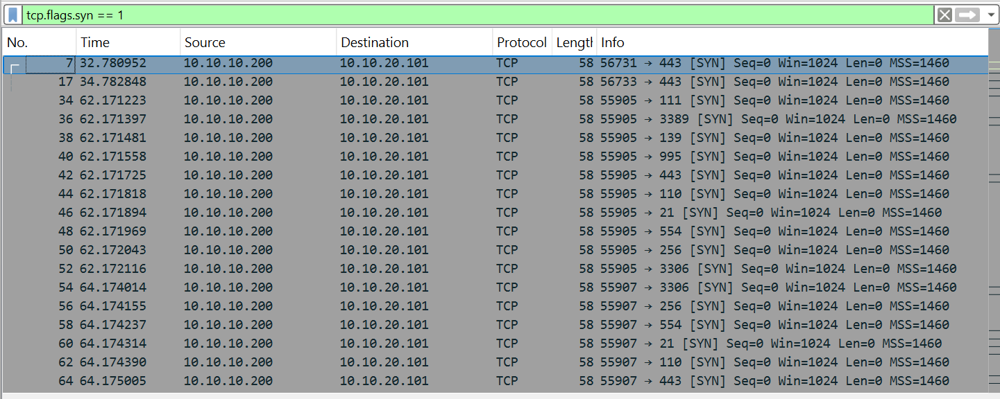
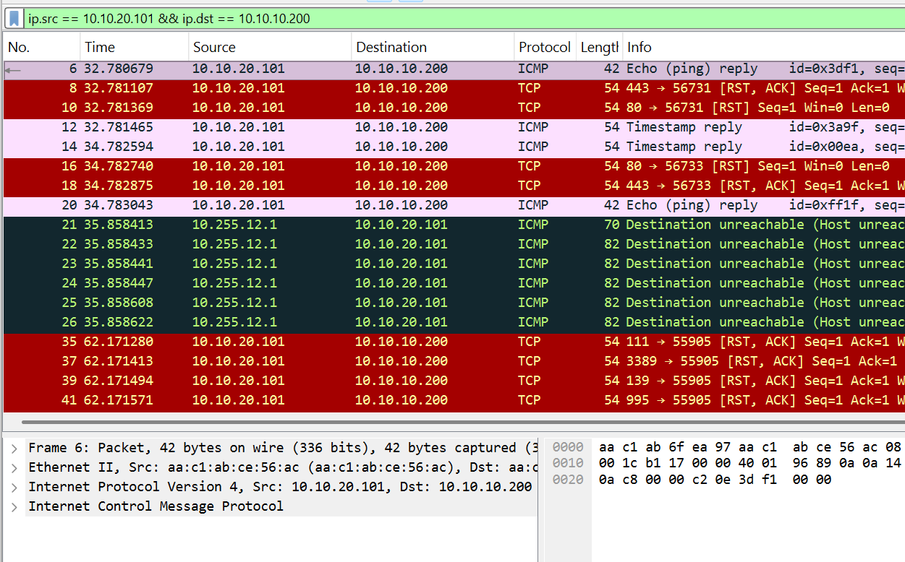
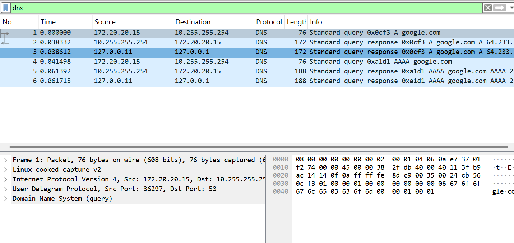

# 1. Johdanto
Tietoturva on tärkeä osa verkonhallintaa. Verkon ylläpitäjän täytyy seurata verkkoliikennettä, palvelimien toimintaa ja lokeja, jotta poikkeava liikenne, tietoturvauhat ja virheelliset konfiguraatiot voidaan havaita. Verkkoliikenteen analysoinnilla ja lokien tarkastelulla voidaan selvittää, mitä verkossa tapahtuu ja tunnistaa mahdollisia tietoturvaongelmia.

# 2. Kaappaus

Liikenteen kaappaus suoritettiin web1-palvelimella tcpdump-ohjelmalla.

Käytetty komento:

```bash
tcpdump -i eth1 -w web1.pcap
```

Kaappaus suoritettiin verkkoliitännästä `eth1`. Kaappauksen aikana tallentui 2216 pakettia. 


# 3. Porttiskannaus

Suoritin porttiskannauksen attacker-kontista Nmap-ohjelmalla.

Ensimmäinen komento:

```bash
nmap 10.10.20.101
```

Nmap ilmoitti, että kohde näytti olevan poissa käytöstä. Tämän jälkeen tein skannauksen ilman ping-tarkistusta:

```bash
nmap -Pn 10.10.20.101
```

Skannaus lähetti TCP SYN -paketteja attacker-koneelta web1-palvelimelle. Skannauksessa testattiin useita portteja, kuten portteja 21, 443, 3306 ja 3389.

Skannaus jäi odottamaan vastauksia ja keskeytettiin. Liikenne tallentui tcpdump-kaappaukseen.


## 4. Wireshark

Kaapattu tiedosto `web1.pcap` avattiin Wireshark-ohjelmassa. Liikenteen tarkasteluun käytettiin seuraavaa suodatinta:

```text
tcp.flags.syn == 1
```

Wiresharkista havaittiin seuraavat tiedot:

- Skannauksen lähde-IP-osoite: `10.10.10.200`
- Kohde-IP-osoite: `10.10.20.101`
- Liikenteen protokolla: TCP
- Pakettityyppi: SYN



Palvelimen vastauksia tarkasteltiin seuraavalla suodattimella:

```text
ip.src == 10.10.20.101 && ip.dst == 10.10.10.200
```

Palvelin lähetti useisiin portteihin TCP RST, ACK -vastauksia. Tämä tarkoittaa, että yhteys hylättiin tai portti ei hyväksynyt yhteyttä. Kaappauksessa näkyi myös ICMP-vastauksia ja Destination unreachable -viestejä.



## DNS-liikenne

DNS-liikenteen kaappaus tcpdump-ohjelmalla:

```bash
tcpdump -i any -w /dns.pcap port 53
```
DNS-kysely suoritettiin komennolla:
```bash
nslookup google.com
```
Wiresharkissa näkyy DNS-liikenne:


## HTTP-liikenne

Wiresharkissa käytettiin suodatinta `http`, mutta HTTP-liikennettä ei havaittu.
HTTP-pyyntöä testattiin attacker-kontista komennolla:

```bash
curl http://10.10.20.101
```
Pyyntö ei saanut vastausta.
Tarkistin kuuntelevat portit komennolla:
```bash
ps aux
```
Tuloksessa näkyi Bash ja tcpdump, mutta ei esimerkiksi apache2- tai nginx-prosessia.

Näiden tarkistusten perusteella, web1-kontissa ei ole käynnissä HTTP-palvelinta.

# 5. Loki-analyysi


Lokihakemistosta tarkistettiin käytettävissä olevat lokitiedostot:

```bash
ls -lah /var/log/
```
Lokitiedostot auth.log ja syslog puuttuivat kontista. Sen sijaan tarkasteltiin Node Exporterin lokia:
```bash
cat /var/log/node_exporter.log
```
Lokista havaittiin, että Node Exporter käynnistyi 28.8.2026 klo 08:00:53. Palvelu kuuntelee portissa 9100.

Lokissa esiintyi seuraavia havaintoja:

- Node Exporter käynnistyi onnistuneesti.

- Palvelu ilmoitti toimivansa root-käyttäjänä.

- Diskstats-keräin ei pystynyt avaamaan /run/udev/data-hakemistoa, minkä vuoksi udev-laitetietojen kerääminen poistettiin käytöstä.

- TLS oli poistettu käytöstä Node Exporterin yhteydessä.

- Kirjautumisia ei voitu tarkastella, koska auth.log-tiedostoa ei ollut saatavilla. Myöskään syslog-tiedostoa ei löytynyt.

# 6. Turvallisuusarvio
Verkko- ja palvelinympäristössä havaittiin seuraavia turvallisuuteen liittyviä asioita.

## Turvallista

- Verkkoliikenteen seuranta: Liikennettä voidaan kaapata tcpdumpilla ja analysoida Wiresharkilla.

- Lokien kerääminen: Node Exporter kirjoittaa lokitiedostoa, josta voidaan tarkastella palvelun käynnistymistä ja virheitä.

- Konttien eristäminen: Palvelut toimivat Docker-konteissa, mikä eristää niitä osittain muusta järjestelmästä.

## Tietoturvariskit

- Porttiskannaus: Attacker-kontista voitiin lähettää useita TCP SYN -paketteja web1-palvelimelle. Tämä voi paljastaa avoimia palveluita ja auttaa hyökkääjää.

- TLS ei ole käytössä Node Exporterissa: Lokissa ilmoitettiin, että TLS on poistettu käytöstä. Liikenne voi tällöin olla suojaamatonta.

- Node Exporter toimii root-käyttäjänä: Lokissa ilmoitettiin, että palvelu toimii root-käyttäjän oikeuksilla. Palvelun haavoittuvuus voisi aiheuttaa suuremman riskin.

## Mitä pitäisi parantaa?

- Rajoitetaan verkkoliikennettä palomuurisäännöillä, jotta vain tarvittavat portit ja yhteydet sallitaan.

- Node Exporter pitäisi suorittaa tavallisella käyttäjällä root-käyttäjän sijaan.

- TLS-salaus pitäisi ottaa käyttöön Node Exporterin liikenteessä.

- Lokien hallintaa pitäisi parantaa, koska auth.log- ja syslog-tiedostoja ei ollut saatavilla. Keskitetty lokien kerääminen helpottaisi tapahtumien tutkimista.

Ympäristössä on käytössä liikenteen seuranta ja lokitiedostot, mutta palveluiden käyttöoikeuksia, salausta ja lokien hallintaa pitäisi kehittää. Lisäksi verkkoliikennettä tulisi rajoittaa palomuurilla porttiskannausten ja luvattomien yhteyksien vähentämiseksi.

# 7. Yhteenveto
Tehtävässä opin käyttämään tcpdump- ja Wireshark-työkaluja verkkoliikenteen kaappaamiseen ja analysointiin. Opin myös tunnistamaan porttiskannauksen liikenteestä sekä tarkastelemaan palvelimen lokitiedostoja. Lisäksi opin, että kaikissa konteissa ei välttämättä ole perinteisiä lokitiedostoja, kuten syslog tai auth.log.

Tekoälyn käyttö

Tekoälyä käytettiin tehtävän aikana apuna komentojen ja niiden tulosten tulkitsemisessa sekä tiedon analysoinnissa. Tekoälyn avulla selvitettiin esimerkiksi lokitiedoista löytyneiden tapahtumien merkitystä. Työkalujen käyttö ja komentojen suorittamisen tein itse.