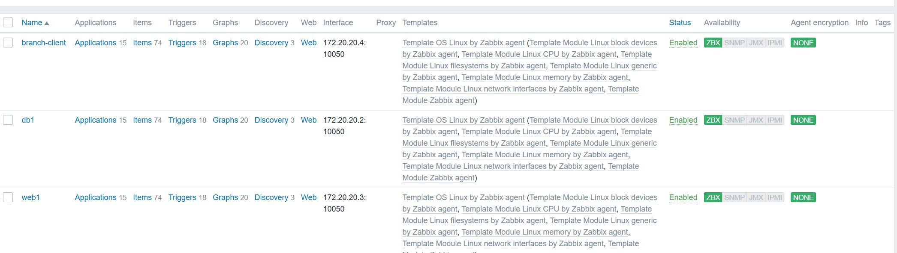
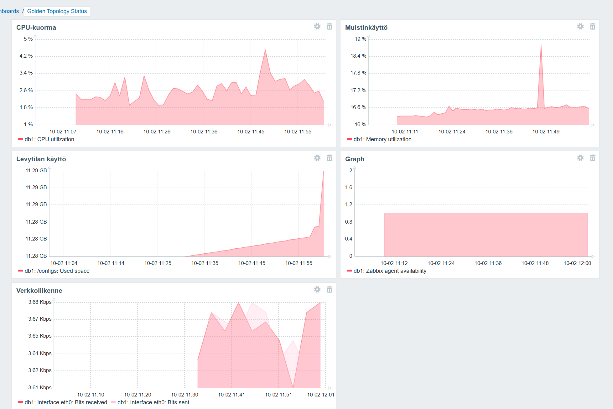
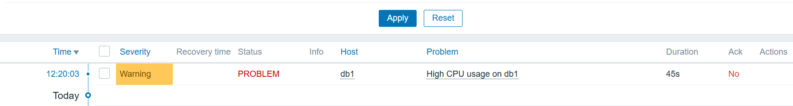
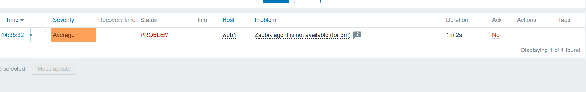

# 1. Johdanto
Zabbix on valvontajärjestelmä, jolla voidaan seurata palvelimien,
verkkolaitteiden ja muiden laitteiden toimintaa. Sen avulla voidaan
kerätä mittaritietoja, näyttää niitä dashboardeilla ja muodostaa
hälytyksiä poikkeavista tilanteista.

| **Osio** | **Kuvaus** |
|---|---|
| **Hosts** | Hosts-näkymässä hallitaan valvottavia laitteita ja palvelimia. |
| **Templates** | Templates sisältää valmiita valvontamäärityksiä, joita voidaan liittää hosteille. |
| **Monitoring** | Monitoring-näkymässä voidaan seurata valvottavien laitteiden tilaa ja kerättyjä mittareita. |
| **Dashboards** | Dashboardeilla voidaan esittää valvontatietoja graafisesti yhdessä näkymässä. |
| **Alerts** | Alerts-näkymässä tarkastellaan syntyneitä hälytyksiä ja ongelmatilanteita. |
| **Reports** | Reports-osiossa voidaan tarkastella ja muodostaa valvontaan liittyviä rap

# 2. Hostien lisääminen
Zabbixiin lisättiin valvottaviksi hosteiksi web1, db1 ja branch-client. Hosteille määritettiin nimi, host group sekä Zabbix-agentin yhteys. Hosteihin liitettiin Template OS Linux by Zabbix agent, jonka avulla voidaan kerätä tietoa muun muassa CPU-kuormasta, muistinkäytöstä, levytilasta, verkkoliikenteestä ja käyttöajasta. 

Aluksi hostien lisääminen Zabbixiin ei yksin riittänyt, koska Zabbix-agenttia ei ollut asennettu. Kaikille konteille asennettiin Zabbix-agentti ja määritettiin se käyttämään Zabbix-palvelinta. 
Agentin asennuksen ja määritysten jälkeen kaikkien kolmen hostin ZBX-tila muuttui vihreäksi. Tämän jälkeen Zabbix pystyi keräämään hosteilta valvontatietoja, kuten suorittimen käyttöä, muistinkäyttöä, käyttöaikaa, levytilaa ja verkkoliikennettä.



# 3. Dashboard
Zabbixiin luotiin dashboard Golden Topology Status. Dashboard kokoaa yhteen CPU-kuorman, muistinkäytön, levytilan käytön, verkkoliikenteen sekä Zabbix-agentin saatavuuden. Näin ympäristön tilannetta voidaan seurata yhdellä silmäyksellä.



# 4. Mittarit
Valitut mittarit ja niiden merkitys.
| **Mittari** | **Arvo** | **Merkitys** |
|---|---:|---|
| **CPU utilization** | **2,5981 %** | Kertoo, kuinka suuri osa CPU:n kapasiteetista on käytössä. |
| **Load average (5m avg)** | **0,522** | Kertoo järjestelmän keskimääräisen kuormituksen viimeisen viiden minuutin aikana. |
| **Memory utilization** | **16,5751 %** | Kertoo, kuinka suuri osa käytettävissä olevasta muistista on käytössä. |
| **Interface eth0: Bits sent** | **3,67 Kbps** | Kertoo, kuinka paljon dataa verkkoliitännän kautta lähetetään tällä hetkellä. |
| **Interface eth0: Bits received** | **3,67 Kbps** | Kertoo, kuinka paljon dataa verkkoliitännän kautta vastaanotetaan tällä hetkellä. |

# 5. Triggerit
Valvontaan määritettiin kaksi triggeriä, joiden avulla Zabbix ilmoittaa poikkeavista resurssien käyttötilanteista.

| Triggerin nimi | Ehto | Vakavuusluokka |
|---|---|---|
| **High CPU usage on db1** | CPU utilization > 80 % | Warning |
| **Low free disk space on db1** | Free disk space < 20 % | Warning |


# 6. Hälytys- ja häiriötestit

CPU-kuormituksen hälytys: CPU-kuormitus nostettiin yli 80 %:iin usealla yes-prosessilla. Zabbix havaitsi tilanteen ja loi High CPU usage on db1 -hälytyksen. Hälytys näkyi Problems-näkymässä Warning-tasolla. Hälytys ilmestyi noin 45 sekunnin kuluessa.



Web1-palvelimen Zabbix-agentti pysäytettiin komennolla 
```bash
service zabbix-agent stop
``` 
Zabbix havaitsi agentin yhteyden katkeamisen ja noin kolmen minuutin kuluttua syntyi Average-tason hälytys Zabbix agent is not available (for 3m). Hälytys näkyi Zabbixin Problems-näkymässä. Häiriön havaitsemiseen kului noin 3 minuuttia.



# 7. Vertailu
| **Ominaisuus** | **SNMP** | **Prometheus** | **Zabbix** |
|---|---|---|---|
| Tiedonkeruu | SNMP-protokolla | Scrape + exporterit | Agentti, SNMP ja muut menetelmät |
| Dashboardit | Ei omaa varsinaista dashboardia | Kyllä, usein Grafanan kanssa | Sisäänrakennetut |
| Hälytykset | Trapit | Alertmanager | Triggerit ja hälytykset |
| Käyttöönotto | Helppo verkkolaitteissa | Vaatii exporterien määrityksiä | Agentit ja templatet |
| Skaalautuvuus | Hyvä | Erittäin hyvä | Hyvä |
| Yrityskäyttö | Verkkolaitteet | Pilvi/DevOps | IT-infrastruktuuri |

# 8. Yhteenveto

Tässä tehtävässä opin, että keskitetystä valvonnasta on paljon hyötyä verkko- ja palvelinympäristön ylläpidossa. Kun eri palvelimien ja palveluiden tiedot kerätään samaan järjestelmään, niiden toimintaa on helpompi seurata eikä jokaista laitetta tarvitse tarkistaa erikseen. 

Zabbixissa esimerkiksi CPU-kuormitusta, muistin käyttöä, levytilaa, verkkoliikennettä ja palveluiden saatavuutta voidaan seurata samasta paikasta.
Mielestäni tärkeimpiä seurattavia asioita ovat erityisesti CPU-kuormitus, muistin ja levytilan käyttö sekä palveluiden saatavuus. Näiden avulla voidaan huomata tilanteita, joissa palvelin alkaa kuormittua tai jokin palvelu ei enää toimi. 

Prometheus sopisi mielestäni hyvin tilanteisiin, joissa halutaan kerätä ja tarkastella paljon suorituskykymittareita ja niiden muutoksia ajan kuluessa. Zabbix puolestaan sopii hyvin koko ympäristön keskitettyyn valvontaan, koska sillä voidaan seurata hosteja, palveluita ja niiden tilaa sekä määrittää hälytyksiä erilaisille ongelmatilanteille. 

Tässä ympäristössä Zabbix oli hyödyllinen juuri tämän kokonaisuuden hallintaan.
Ympäristöön voisi vielä lisätä esimerkiksi lokien valvontaa, tarkempaa palveluiden saatavuuden seurantaa ja ilmoituksia sähköpostiin. Myös verkkoyhteyksien ja levytilan tarkempi seuranta voisi olla hyödyllistä. Kokonaisuutena tehtävä auttoi ymmärtämään paremmin sitä, miten valvontajärjestelmää voidaan käyttää ongelmien havaitsemiseen ja ympäristön toiminnan seuraamiseen.

